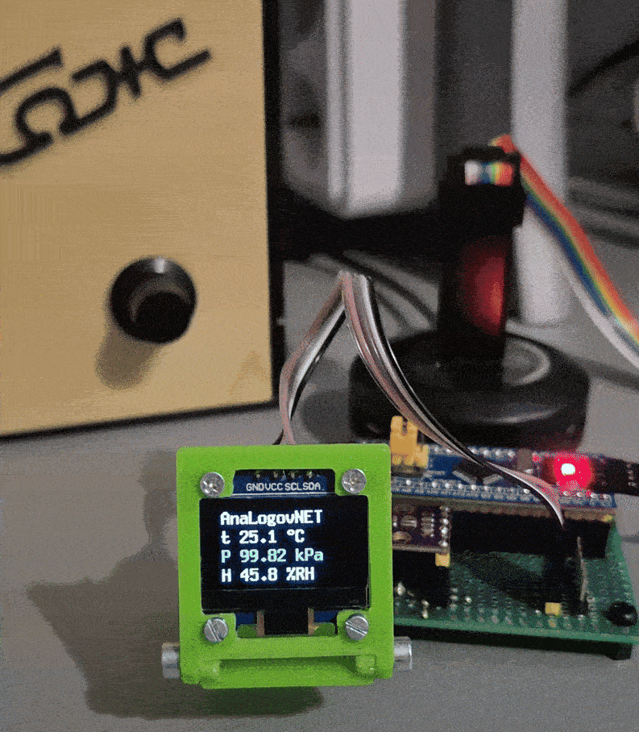

# BME280 u8g2(ssd1306 128x64 OLED) example

### CubeIde project for
* bluePill with stm32f103C6T6
### Using
* ssd1306 128x64 OLED
* u8g2 library past as source (https://github.com/olikraus/u8g2 src, license and stuff there)
* bme280 sensor
* BME280_Sensor API as source (https://github.com/boschsensortec/BME280_SensorAPI src, license and stuff there)

